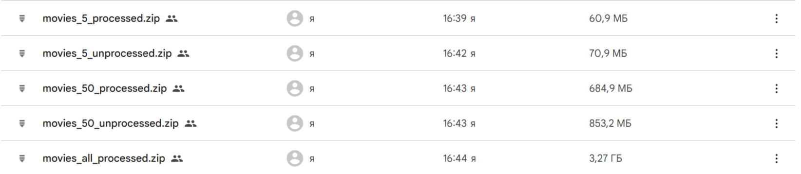
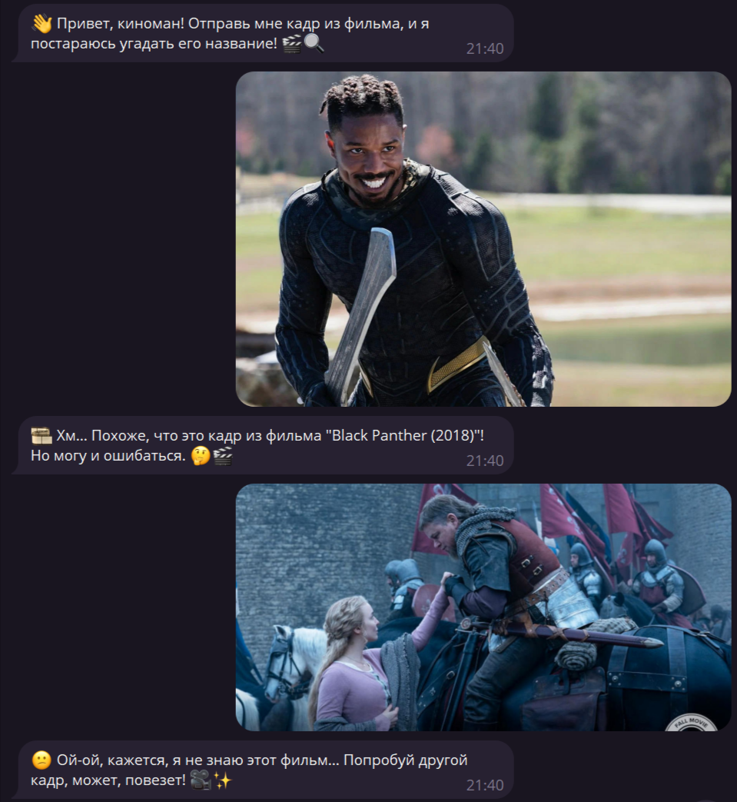
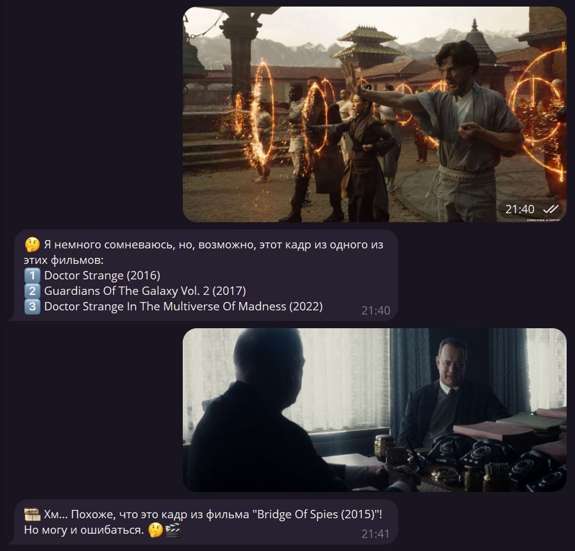
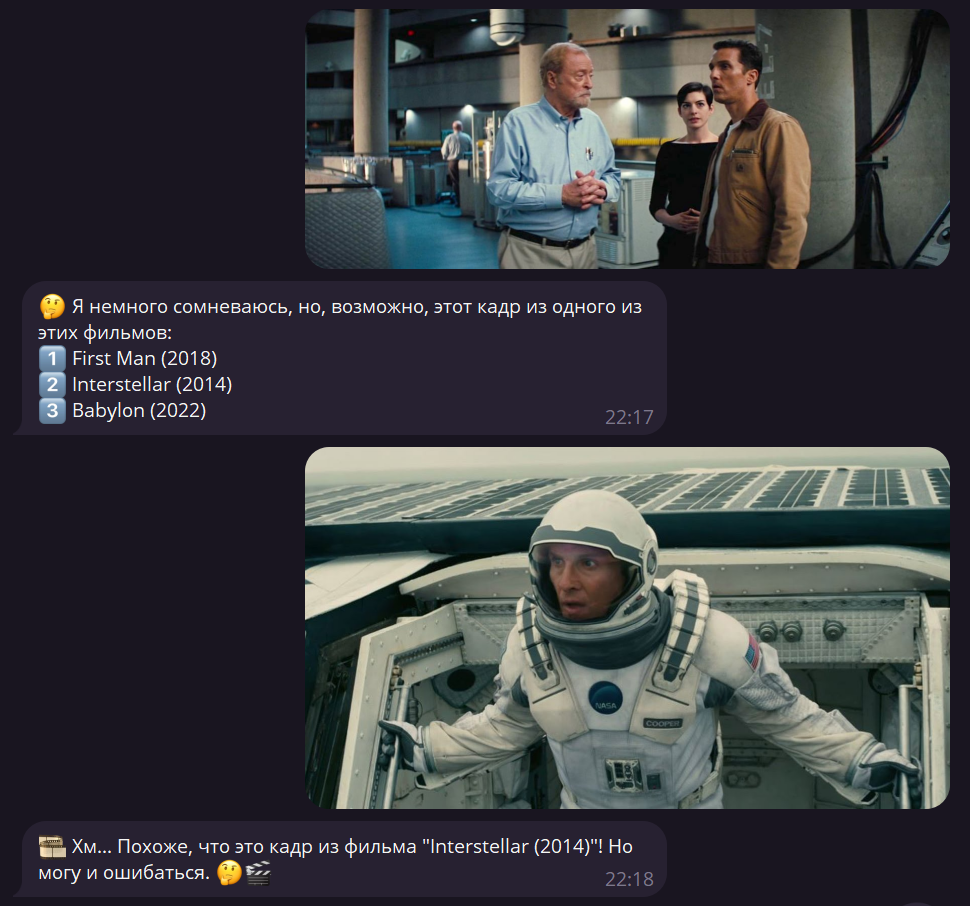
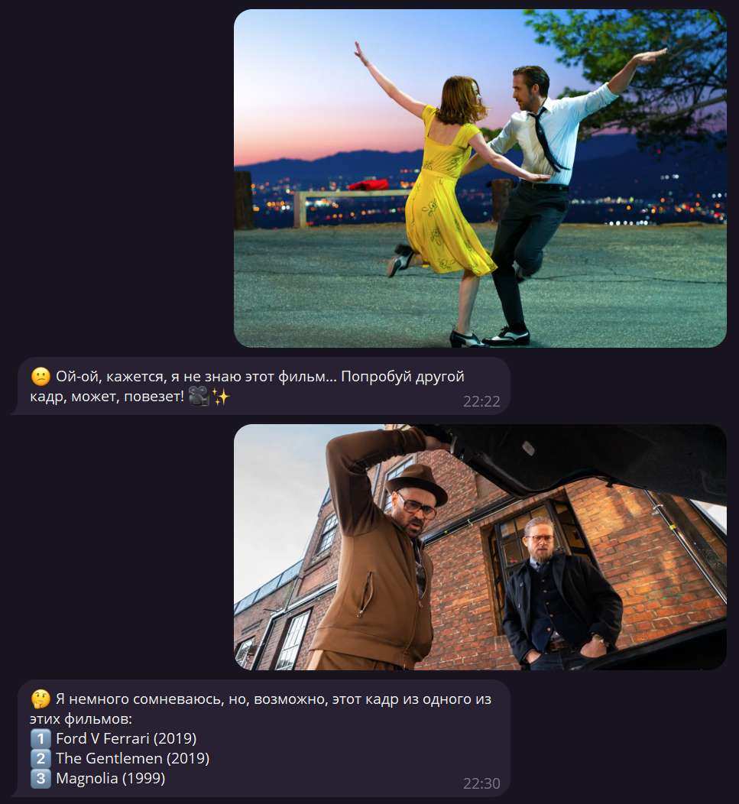
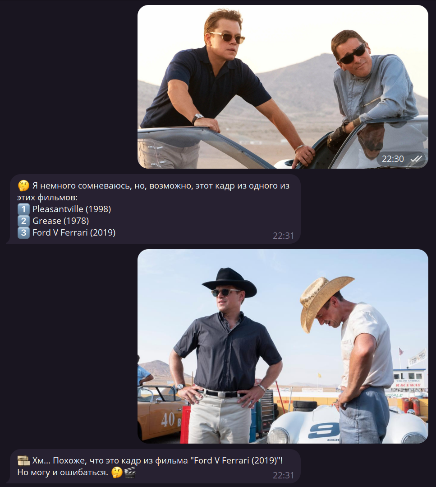

# Movie-by-frame

The main goal of the project is to implement an AI model that will determine `the title of a movie` based on its `frame`.

## Datasets

The original dataset is [here](https://drive.google.com/file/d/1F3LXcQa8zeuJ7F963i4xr2FRGyIM70Cd/view?usp=sharing). After resizing frames and removing common and uninformative frames using `YOLO`, the following datasets were obtained:

* Dataset of 5 films [here](https://drive.google.com/file/d/1fVZGS58fs-yL5huS6ndM1XP6cq-PAGd8/view?usp=sharing)
* Dataset of 50 films [here](https://drive.google.com/file/d/1--6Q00HBevQp6shgiQMf9bvdIcP5i-e7/view?usp=sharing)
* Processed dataset [here](https://drive.google.com/file/d/1-AfgwyKszlHKuAUeqrApnq5A844IcIuR/view?usp=sharing)

## Loading trained model

Since the file with the model coefficients is large for GitHub, the file must be added to the `data` folder with name `model.pt`. The link to this file is [here](https://drive.google.com/file/d/1gawz7Cv1EdS1zssKy1MNO_8IfCpT2txi/view?usp=sharing).

## Telegram-bot token

To use the bot, you need to add `token` to file `.env` in the root of the project as an **environment variable** with the name `TELEGRAM_BOT_TOKEN`.

## Screenshots 

<table>
  <tr>
    <td></td>
    <td></td>
  </tr>
  <tr>
    <td></td>
    <td></td>
  </tr>
  <tr>
    <td></td>
    <td></td>
  </tr>
  <tr>
    <td></td>
    <td></td>
  </tr>
</table>
