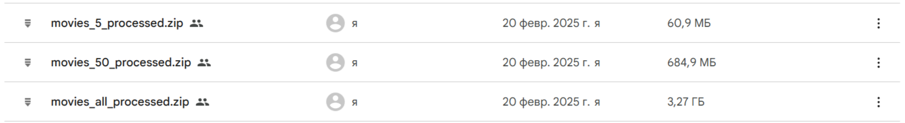

# Movie-by-frame

The main goal of the project is to implement an AI model that will determine `the title of a movie` based on its `frame`

## Datasets

The original dataset is [here](https://drive.google.com/file/d/1F3LXcQa8zeuJ7F963i4xr2FRGyIM70Cd/view?usp=sharing). After resizing frames and removing common and uninformative frames using `YOLO`, the following datasets were obtained:

* Dataset of 5 films [here](https://drive.google.com/file/d/1fVZGS58fs-yL5huS6ndM1XP6cq-PAGd8/view?usp=sharing)
* Dataset of 50 films [here](https://drive.google.com/file/d/1--6Q00HBevQp6shgiQMf9bvdIcP5i-e7/view?usp=sharing)
* Processed dataset [here](https://drive.google.com/file/d/1-AfgwyKszlHKuAUeqrApnq5A844IcIuR/view?usp=sharing)
